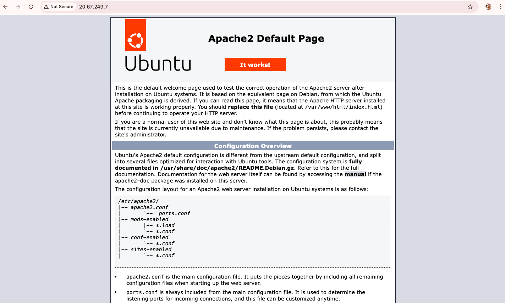
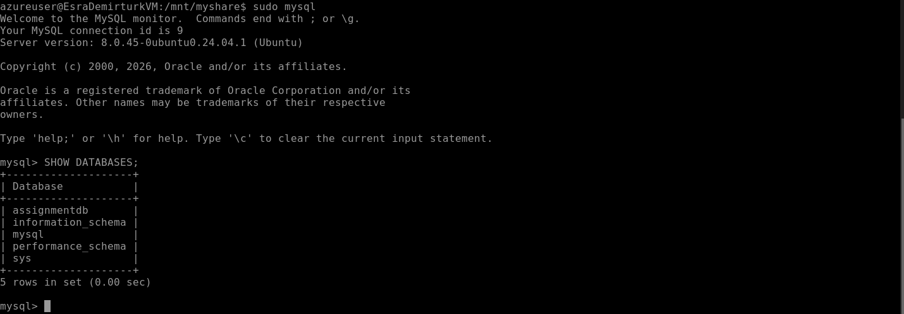
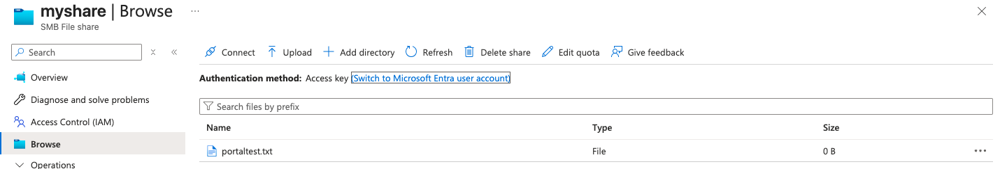
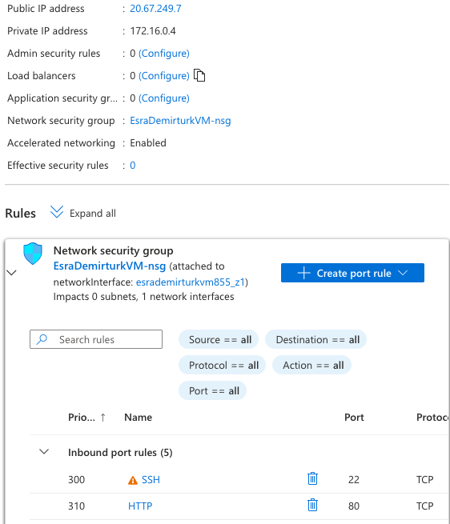

# Azure Virtual Machine & Azure File Share Assignment

## 📌 Project Overview

This project demonstrates the creation and management of a Linux Virtual Machine in Microsoft Azure and the integration of Azure File Share.

The objective of this assignment was to understand:

- Virtual Machine deployment in Azure
- Network configuration (NSG rules)
- Web server installation and publishing
- Database installation and configuration
- Azure File Share creation and mounting using CIFS
- File operations between VM and Azure Storage

---

## ☁️ 1️⃣ Virtual Machine Creation

- Created a Linux (Ubuntu) Virtual Machine
- Configured authentication (username & password)
- Connected using Azure Bastion

---
## 🌐 2️⃣ Apache Web Server Installation

Installed Apache inside the VM:

```bash
sudo apt update
sudo apt install apache2 -y
```

Opened port 80 in Network Security Group.

Verified by accessing:
```
http://PUBLIC-IP
```

Result: Apache default page displayed successfully.

---
## 🐬 3️⃣ MySQL Installation

Installed MySQL:
```
sudo apt install mysql-server -y
```

Created database:
```
CREATE DATABASE assignmentdb;
SHOW DATABASES;
```

Result: Database created successfully.

---
## 💾 4️⃣ Azure File Share

- Created Storage Account

- Created File Share named myshare

- Retrieved Access Key from Azure Portal

Mounted Azure File Share to Linux VM:
```
sudo mount -t cifs //<storage-account>.file.core.windows.net/myshare /mnt/myshare \
-o vers=3.0,username=<storage-account>,password=<access-key>,dir_mode=0777,file_mode=0777,serverino
```
Tested file operations:
```
cd /mnt/myshare
sudo touch test.txt
sudo rm test.txt
```
Result: File successfully created and deleted.
Verified in Azure Portal.

---
## 🔐 5️⃣ Network Configuration

Added inbound rule:

- Port: 80

- Protocol: TCP

- Action: Allow

This allowed public access to Apache.

---

## 📸 Screenshots

### Apache Running


### MySQL Database


### Azure File Share Portal


### Azure File Share Terminal


### Network Rule


---
## ⚠️ Problems Encountered & Solutions

Issue: Apache not accessible from browser
- Solution: Added inbound rule for port 80 in NSG

Issue: MySQL installation returned 404 error
- Solution: Updated package list using sudo apt update

Issue: Azure File Share not visible in portal
- Solution: Re-mounted share using correct access key

---
## 🧹 Clean Up

Deleted:

- Virtual Machine
- Storage Account
- Resource Group
- Public IP
- Network Interface

---

## 🚀 Technologies Used

- Microsoft Azure
- Ubuntu Linux
- Apache
- MySQL
- Azure File Share (SMB / CIFS)
- Network Security Group (NSG)
